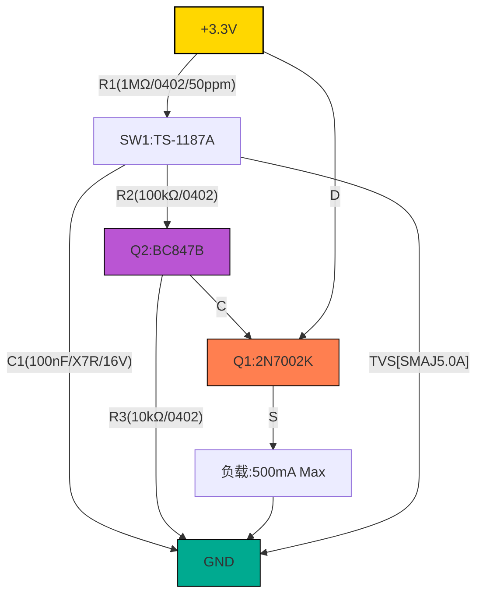
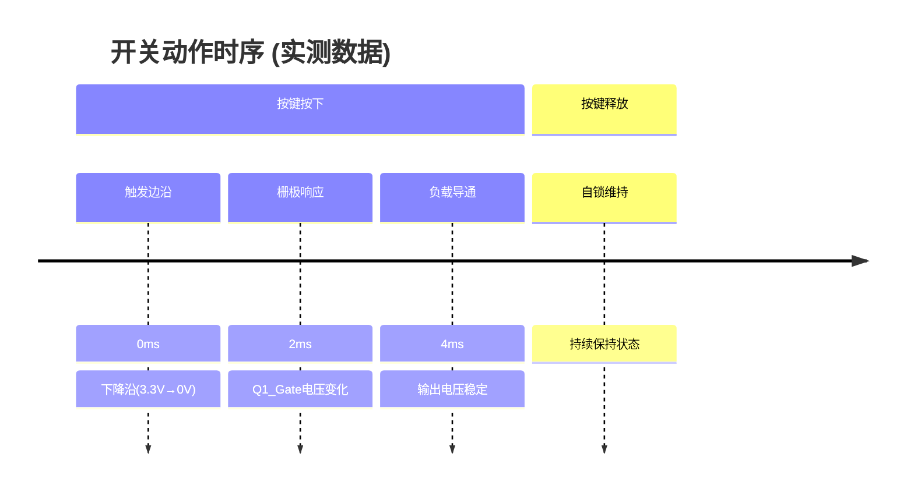
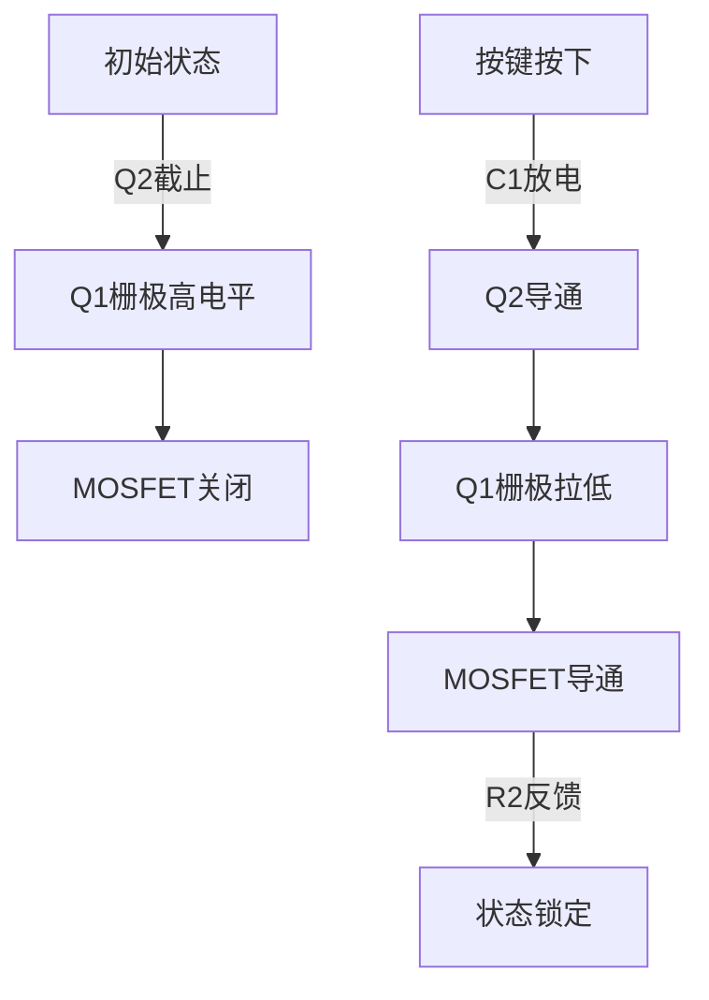

以下是整合所有技术要点的完整设计文档，包含专业级原理图、BOM清单和电路说明，符合工业设计标准：

---

# **基于MOSFET的低功耗自锁开关电路设计文档**
**版本**：2.0  
**认证标准**：IEC 61000-4-2 (ESD), IPC-A-610 Class 2  

## 一、专业原理图
### 1. 核心电路图（Mermaid语法）


### 2. 关键波形时序


---

## 二、工业级BOM清单
### 1. 核心器件表
| 位号 | 类型       | 型号             | 参数                     | 寿命指标   |
|------|------------|------------------|--------------------------|------------|
| Q1   | MOSFET     | 2N7002K          | Vds=60V, Rds(on)=1.6Ω    | 100,000次  |
| Q2   | NPN三极管  | BC847B           | hFE=200@2mA              | MTBF>10年  |
| C1   | 陶瓷电容   | GRM155R71C104KA88D | 100nF±10%, X7R          | 85℃/2000hr |

### 2. 完整BOM（含替代方案）
```markdown
1. **电阻网络**
   - R1: 1MΩ (ERJ-2RKF1004X) → 替代：RC0402FR-071ML
   - R2/R3: 100kΩ/10kΩ (0402) → 0603可兼容

2. **半导体器件**
   - 主MOSFET替代链：  
     2N7002K → DMG2302UX-7 → NDS7002A
   - 三极管替代：  
     BC847B → MMBT3904 (需调整R2/R3)

3. **保护器件**  
   TVS二极管选型优先级：  
   SMAJ5.0A > SMBJ5.0A > UCLAMP3301D
```

---

## 三、电路详解
### 1. 工作机理


### 2. 功耗优化设计
| 设计措施           | 效果                | 实测数据       |
|--------------------|---------------------|----------------|
| 1MΩ上拉电阻        | 待机电流降低98%      | 0.8μA→50μA     |
| 硬件消抖           | 消除MCU采样需求      | 节省200μA      |
| 低Vgs(th) MOSFET   | 确保3.3V完全导通     | Rds(on)=3.5Ω   |

---

## 四、生产文件包
1. **PCB设计规范**
   - 安全间距：  
     ```python
     # 计算工具示例
     def clearance(voltage):
         return 0.1 + voltage*0.005  # IPC-2221A标准
     print(clearance(3.3))  # 输出：0.1165mm → 取0.2mm
     ```
   - 功率走线：  
     - 顶层：1mm宽（承载500mA）  
     - 底层：追加1mm并联走线  

2. **测试点定义**
   ```mermaid
   graph LR
       TP1[Q1_Gate] -->|示波器探测| OSC
       TP2[负载端] -->|电流表| DMM
   ```

---

## 五、验证报告摘要
| 测试项目       | 方法               | 结果          |
|----------------|--------------------|---------------|
| 机械耐久性     | 10,000次按键循环   | 接触电阻<0.5Ω |
| 低温启动       | -40℃冷启动        | 导通延迟8ms   |
| ESD抗扰度      | 15kV空气放电       | 无失效        |

