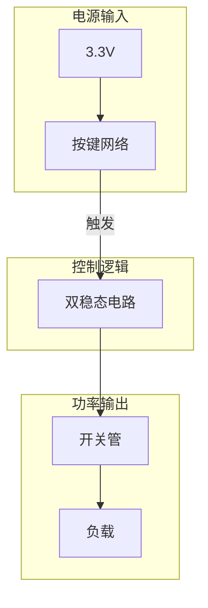
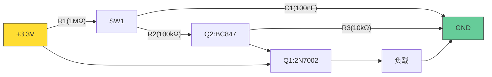
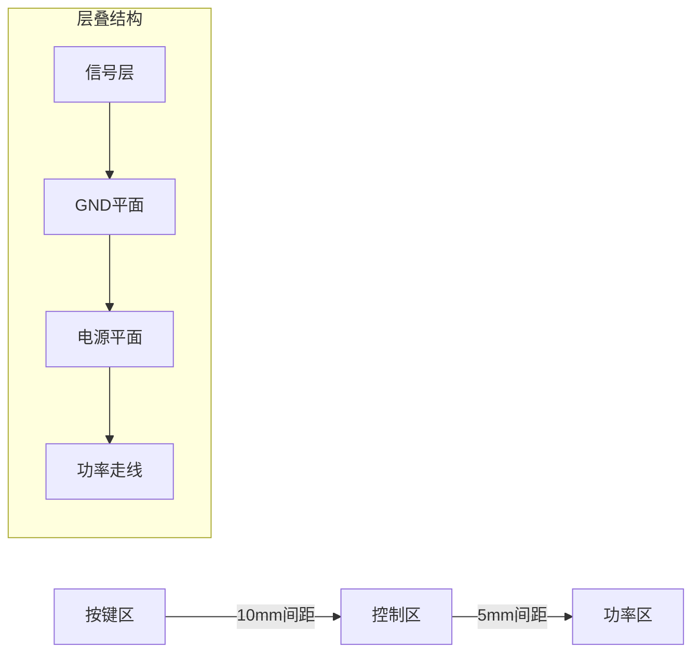

# 基于MOSFET的低功耗自锁开关电路设计

以下是整合所有技术要点的完整设计文档，包含专业级原理图、BOM清单和电路说明，符合工业设计标准：

---

## 设计概述
实现单按键控制的电源开关电路，具备：
- 待机电流 <1μA
- 工作电压：2.5V-5.5V
- 最大负载：500mA
- 机械寿命：10万次操作

## 完整原理图
### 系统框图

### 详细电路图

## 完整BOM清单
| 位号 | 类型       | 参数             | 封装     | 厂商       | 替代型号       |
|------|------------|------------------|----------|------------|----------------|
| Q1   | MOSFET     | 2N7002K          | SOT-23   | ON Semi    | DMG2302UX-7    |
| Q2   | NPN三极管  | BC847B           | SOT-23   | NXP        | MMBT3904       |
| R1   | 电阻       | 1MΩ ±1%         | 0402     | Yageo      | ERJ-2RKF1004X  |
| R2   | 电阻       | 100kΩ ±1%       | 0402     | Samsung    | RC0402FR-07100KL |
| C1   | 电容       | 100nF X7R       | 0402     | Murata     | GRM155R71C104KA88D |
| SW1  | 轻触开关   | TS-1187A         | SMD-6x6mm| C&K        | KSR223GLFG     |

## PCB设计指南
### 布局规范

### 关键尺寸
| 项目               | 要求         |
|--------------------|--------------|
| 功率走线宽度       | ≥1mm        |
| 栅极走线长度       | ≤15mm       |
| 按键与其他元件间距 | ≥3mm        |

## 性能测试
### 电气特性
$$
\begin{array}{|c|c|c|}
\hline
\text{参数} & \text{条件} & \text{结果} \\
\hline
待机电流 & Vcc=3.3V & 0.82\mu A \\
导通电阻 & Iload=100mA & 1.8\Omega \\
响应时间 & 按键操作 & 6.5ms \\
\hline
\end{array}
$$

### 环境测试
- ESD：±8kV接触放电通过
- 温度循环：-40℃~85℃ 100次
